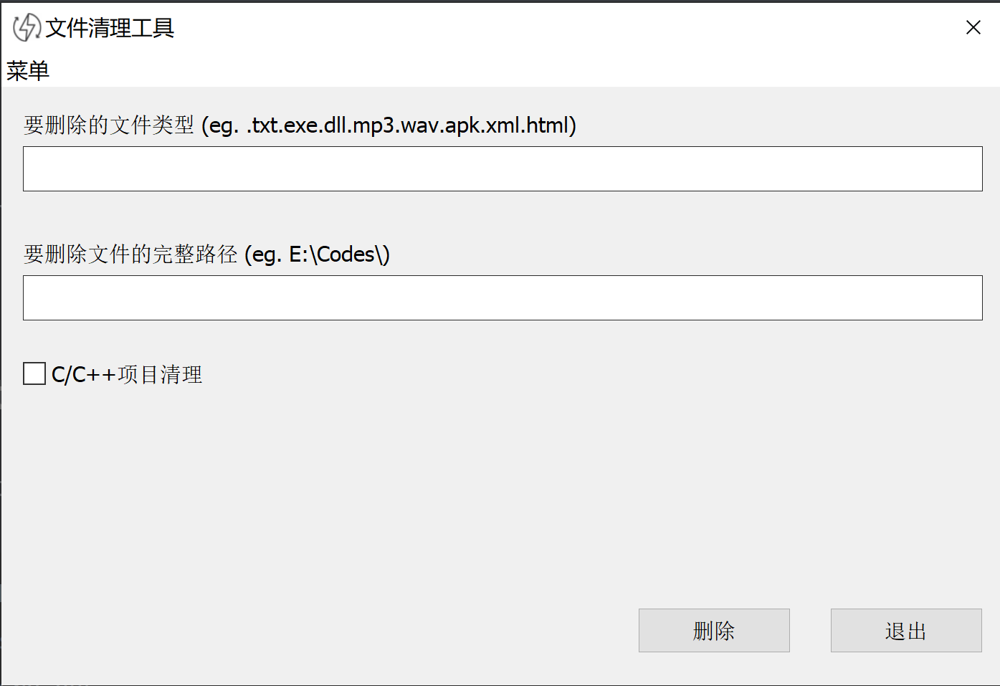

## DeleteFileTools

This tool is used to delete files of specified types. Learn from Tennn. Written by mfc framework.

## Menu

- [How to use](#how-to-use)
- [How to build](#how-to-build)
  - [Visual Studio](#visual-studio)
- [GUI Snapshot](#gui-snapshot)

## How to use

Just compile and run.

## How to build

### Prepare the environment

### Visual Studio

1. Open **DeleteFileTest.sln** use visual studio
2. Just build it
3. run

## GUI Snapshot

main window:

